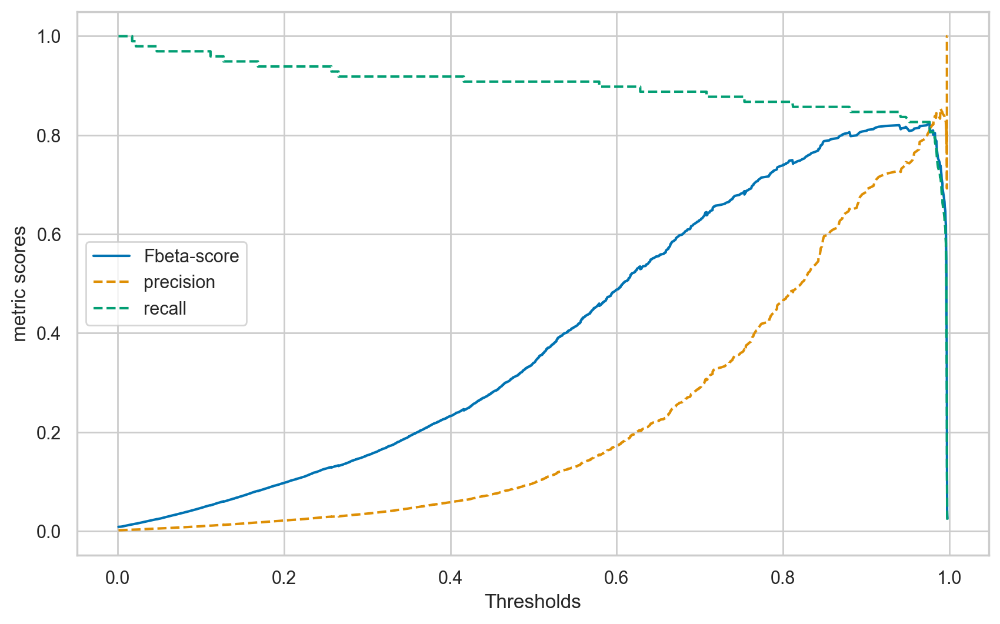
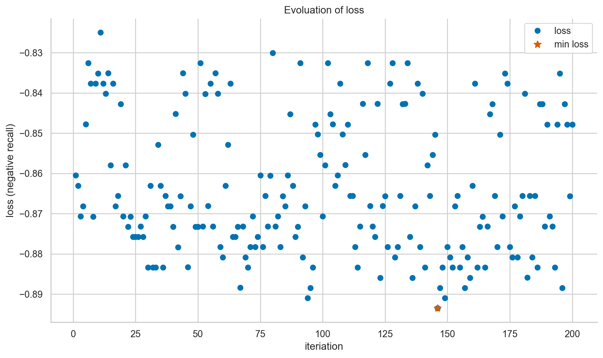
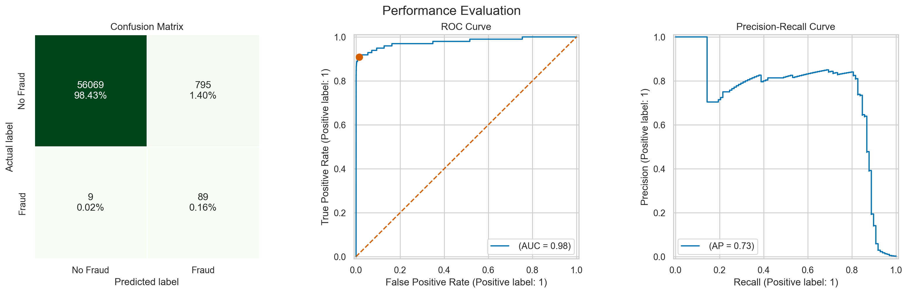

# Credit-Card-Fraud-Detection
## Project aims and descriptions:
## OBJECTIVES: 

In this project, we investigated a suite of weighted machine learning methods that are commonly used to address skewed class distributions. Also investigated are data sampling approaches to address class imbalance. The following aspects are addressed in this project:
- Exploring the credit card dataset using the Dtale Data Explorer.
- Framing the fraud detection problem, developing a test harness, and evaluating the baseline model. 
- Exploring a set of weighted machine learning algorithms and ensembles.
- Exploring a suite of data sampling methods to address class imbalance.
- In imbalanced classification problems such as fraud detection, the cost of misclassifying a fraudulent transaction as non-fraudulent (a false negative, FN) is typically higher than misclassifying a legitimate transaction as fraudulent (a false positive, FP). As a result, this project prioritizes optimizing recall—the true positive rate—to maximize the detection of fraudulent cases, even if it comes at the expense of precision. This reflects a deliberate trade-off that favors identifying as many true frauds as possible, accepting a higher false alarm rate.
- Implementing Bayesian hyperparameter searching based on the recall score to get a better coverage of fraudulent transactions.
- Determining the optimal threshold based on F2-measure:

  $$\text{F2-measure} = \frac{(1 + 2^2) \times (\text{precision} \times \text{recall})}{(2^2 \times \text{precision} + \text{recall})}$$

  

   - This metric applies more weight to recall to limit FN, i.e., legitimate fraud cases misclassified as non-fraud.
- Finalising and potential improvements.

## Conclusion and recommendation
- In this highly skewed fraud investigation dataset, the SMOTE + LGMClassifier pipeline produced the highest recall score without causing a significant deterioration in other metrics considered, achieving a recall of 0.867 and pr AUC of 0.846. As we are interested in attaining more coverage of fraudulent cases, we implemented Bayesian hyperparameter optimisation, using negative recall as the objective function (i.e., $$\text{min} \big(-f(x)\big) = \text{max} \big(f(x)\big)$$).

  

  
- Based on the optimal set of hyperparameters, we managed to boost the recall score to 0.908 at the expense of precision. As can be seen from the confusion matrix, our model managed to correctly classify most of the fraudulent causes in the test set.

  

- Instead of using SMOTE, one could also explore BorderlineSMOTE in further work. Even better, one could optimise recall based on weighted machine learning models, which achieved good performance in this study. It will be interesting to see how the results compare. 
- Furthermore, one can explore one-class algorithms in this work as well. The ones that l can think of are isolation forests or one-class support vector machines. Due to the severe class imbalance, I believe these algorithms could yield very interesting and useful results.
